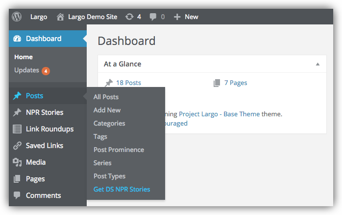
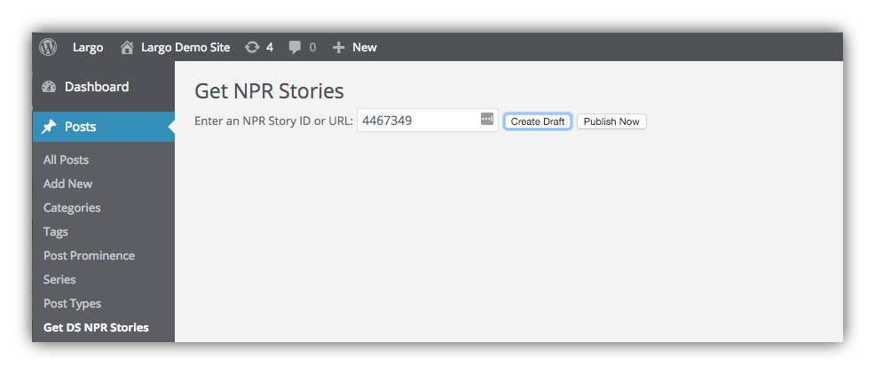
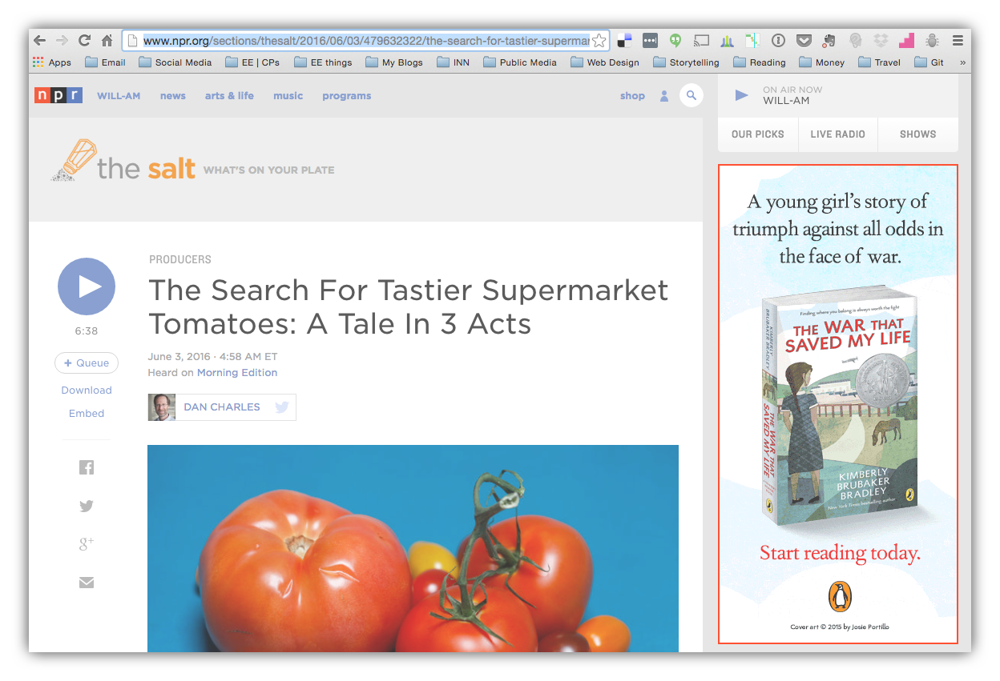
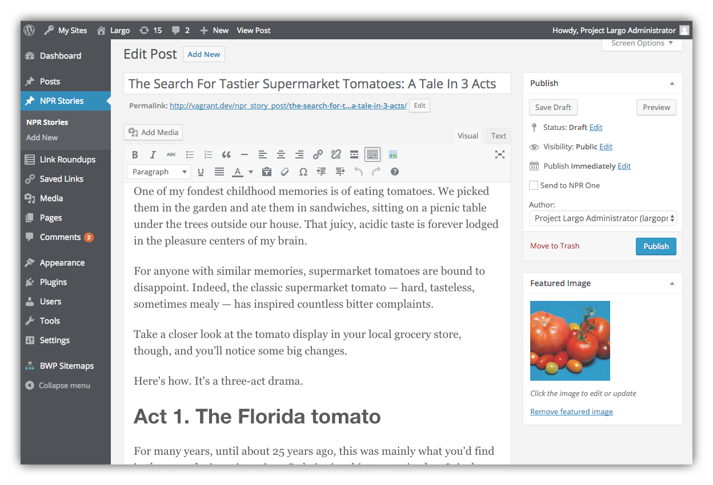
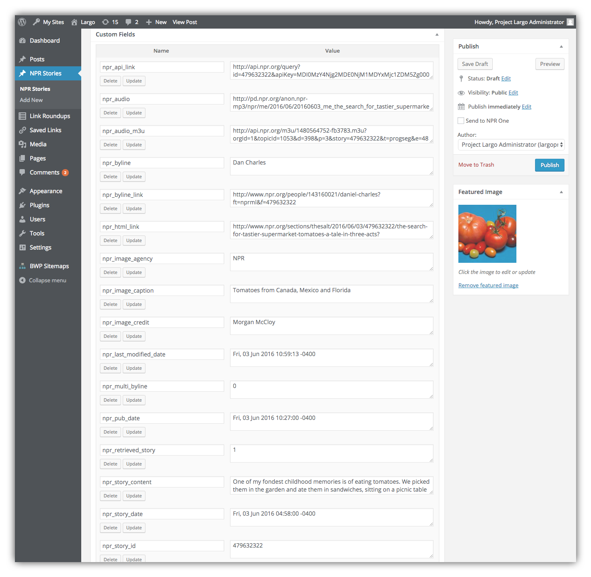

# Pulling a Single Story from the NPR API

Once you have the [WP NPR API Plugin configured](/docs/settings.md), you can easily pull a story from the API into WordPress using a Story ID or URL.

In the WordPress Dashboard under **Posts** you will see a link for **Get DS NPR Stories**:

This opens a screen with a single field where you can paste a Story ID:

Alternatively, you can copy the full URL of a story from the NPR website:

Then paste the URL into this field:

You have the choice to create a draft post of the story, or publish the story immediately. Either way you can edit the story like any other WordPress post:

## NPR Story Custom Fields

Stories in the NPR Story API contain lots of metadata. When you pull a story from the API, WordPress will store this metadata in custom fields. This may include audio files, bylines, image captions and credits, and many other values including the story ID:

If you don't see these custom fields in the post edit screen, click **Screen Options** in the upper right and then the checkbox for Custom Fields.

## Using NPR API Custom Fields in WordPress Templates

The custom fields generated by the NPR API provide lots of flexibility for displaying API content in various ways. If you are familiar with WordPress theming, you could customize your WordPress theme to use the custom fields in your templates.