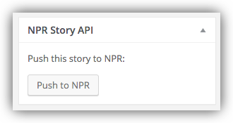
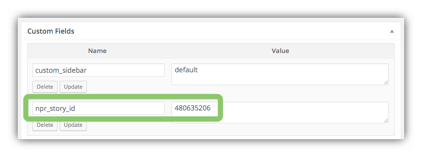

# Pushing Stories to the NPR API

You can push any of your posts to the NPR API by simply using the **Push to NPR** button in the post edit screen:

By default any standard WordPress post can be pushed to the NPR API. If you have a custom post type you want to reserve for stories pushed to the API, you can select this in the **Settings > NPR API > NPR Push Post Type** setting, and only those posts will be pushed. 

## Verifying Pushed Stories

After publishing the post and pushing it to NPR we can easily verify that it was successfully pushed to the API by checking for an `npr_story_id` value in the post's Custom Fields:

If the push fails you will instead see an error message in a custom field named `npr_push_story_error`:

If you get push errors, check **Settings > NPR API** to make sure correct values are entered for your API Key, Pull URL, Push URL, Org ID, and NPR Push Post Type. (See the [WP NPR API Plugin Settings page for details](settings.md).)

If you don't see these custom fields in the post edit screen, click **Screen Options** in the upper right and then the checkbox for Custom Fields.

## Pushing Story Updates to the NPR API

If you edit a story that's previously been pushed to the NPR API, when you update the post it will automatically update the story in the NPR API.

## Deleting Posts from the NPR API

You can delete any of your stories from the NPR API by simply deleting them in WordPress. Stories you pull from the API can't be deleted in this way, as you only have delete access to stories pushed to the API from your WordPress site.